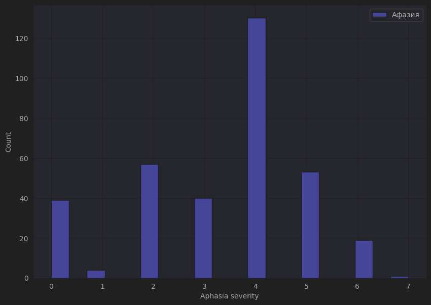
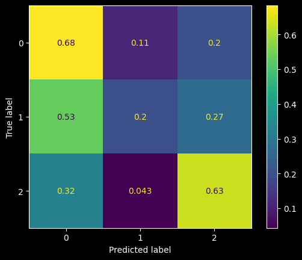

# Классификация афазии на основе речи пациента

## Навигация по репозиторию

* checkpoints — директория, где хранятся(локально) веса моделей. Для каждой модели своя директория внутри
* data — директория для данных
* image — изображения, которые отображаются в README.md
* models — python файлы с классами моделей
* notebooks — ноутбуки с экспериментами
  * 2d_mfcc_test — обучение CNN на MFCC (для них в основном используются одномерные свёртки)
  * aphasia_audio_chunks — обучение CNN на спектрограммах (аудио разбиты на чанки)
  * aphasia_experiments — обучение CNN на спектрограммах 
  * base_analysis — EDA
  * catboost_test — Обучение CatBoost
  * cnn_mc_test — Обучение CNN для мультклассовой задачи
  * data_splitting — разбиение данных
  * data_splitting_multiclass — разбиение данных для мультиклассовой задачи
  * hubert_test_mc — Обучение Hubert для мультиклассовой задачи
  * hubert_test_mc_triplet — Обучение Hubert для мультиклассовой задачи. Hubert изначально обучался на triplet loss
  * ml_test_all_features — Эксперименты с классическим ML
  * robustness_test — Проверка устойчивости моделей к аугментациям
  * swishnet_chunked_test — Обучение SwishNet на чанках аудио
  * swishnet_test — Обучение SwishNet целом аудио
  * wav2vec_mc_test — Обучение Wav2Vec для мультиклассовой задачи
  * wav2vec_test — Обучение Wav2Vec
  * wav2vec_test_2 — Тестирование Wav2Veс (предсказание для испытуемого, а не для аудио; предсказания для целых аудио)
* python scrips — Код для запуска на удалённом кластере
* src — Код вспомогательных функций/классов и веб-приложение на streamlit

## Постановка задачи

Системы ассистирования являются одним из востребованных направлений в машинном обучении. 
Уже сегодня некоторые врачи используют искусственный интеллект в своей работе. Это упрощает постановку
диагноза и помогает назначать персональное лечение каждому пациенту.
 
 
Моя работа направлена на создание модели предсказания наличия афазии у пациента. Афазия — речевое расстройство
с нарушением понимания речи. Оно часто возникает после инсульта, черепно-мозговых травм и заболеваний связанных
с центральной нервной системы. Это заболевание очень сильно может нарушить способность коммуницировать 
с окружающими, что особенно сильно бьёт по пожилым людям. Однако, если вовремя начать, то его можно излечить.
Поэтому важно иметь инструмент, который, в случае возникновения первых признаков, укажет на наличие афазии.

## Датасет

Датасет предоставила лаборатория социальной когнитивной информатики. Всего 353 испытуемых с афазией
и 101 без афазии. На каждого испытуемого ~2 аудиозаписи. Испытуемые из разных возрастных групп. Средний возраст
испытуемых с афазией 58 лет, и его распределение похоже на нормальное. Возраст испытуемых без афазии 
распределён более равномерно, есть как молодые участники, так и пожилые.
 
Ниже распределение тяжести афазии:

Распределение тяжести афазии

Далее будут метрики как для каждого сэмпла, так и агрегация по всем аудио для каждого испытуемого(т.е. предсказание
не для аудио, а для испытуемого).

## Классический ML

В качестве бейзлайна был взят классический ML, т.к. в некоторых задачах иногда может хватить только его.
Был взят FLAML, т.к. он совмещает в себе автоматический выбор модели и гиперпараметров для них.
В качестве фичей подавались MFCC+ZCR, Prosody Features+ZCR, и набор из нескольких фичей (MFCC,
Chromagram, Spectral Features, Prosody Features, ZCR, Timestamps). Ниже приведены результаты:

| Эксперимент         | Метрики                                                         | Метрики для агрегации                                           | 
|---------------------|-----------------------------------------------------------------|-----------------------------------------------------------------|
| FLAML, Prosody+ZCR  | accuracy: 0.87   f1 pos=norm: 0.69   f1 pos=aphasia: 0.92 | accuracy: 0.89   f1 pos=norm: 0.79   f1 pos=aphasia: 0.92 |
| FLAML, MFCC+ZCR     | accuracy: 0.79   f1 pos=norm: 0.55   f1 pos=aphasia: 0.86 | accuracy: 0.82   f1 pos=norm: 0.71   f1 pos=aphasia: 0.87 |
| FLAML, All features | accuracy: 0.87   f1 pos=norm: 0.69   f1 pos=aphasia: 0.92 | -                                                               |

## MFCC

MFCC — представление аудио представляющие собой коэффициенты для временных отрезков, получаемые при 
помощи свёртки спектрограммы с "особыми фильтрами". Если рассматривать физический смысл, то
это симуляция того, как человек говорит(как симуляция человеческого слуха в мел-спектрограммах). Т.к. у нас аудио 
с речью испытуемых, то звучит логично, что нужно брать такое представление, которое можно интерпретировать как речевые 
признаки.
 
В статьях часто используют либо классический ML, либо одномерные свёртки. Ниже приведены все DL эксперименты с MFCC:

| Эксперимент                                                                            | Метрики                                                           | Метрики для агрегации                                             |
|----------------------------------------------------------------------------------------|-------------------------------------------------------------------|-------------------------------------------------------------------|
| SwishNet, MFCC,   аудио целиком,   20 эпох, валидация на аудио целиком         | accuracy: 0.74   f1 pos=norm: 0.60   f1 pos=aphasia: 0.81 | accuracy: 0.76   f1 pos=norm: 0.70   f1 pos=aphasia: 0.80 |
| SwishNet, MFCC,   нарезка на куски по 10-15 c.,   6 эпох, валидация на кусках  | accuracy: 0.90   f1 pos=norm: 0.68   f1 pos=aphasia: 0.94 | accuracy: 0.94   f1 pos=norm: 0.90   f1 pos=aphasia: 0.96 |
| MobileNet, MFCC,   нарезка на куски по 10-15 с.,  10 эпох, валидация на кусках | accuracy: 0.94   f1 pos=norm: 0.76   f1 pos=aphasia: 0.96 | accuracy: 0.97   f1 pos=norm: 0.95   f1 pos=aphasia: 0.98 |
| MobileNet, MFCC,   нарезка на куски по 10-15 с.,  10 эпох, валидация на целых  | accuracy: 0.92   f1 pos=norm: 0.82   f1 pos=aphasia: 0.95 | accuracy: 0.92   f1 pos=norm: 0.85   f1 pos=aphasia: 0.94 |

## Waveform

Одна из очевидных идей — взять сырое аудио и засунуть в трансформер. Далее результаты использования wav2vec

| Эксперимент                                                                                                      | Метрики                                                           | Метрики для агрегации                                             |
|------------------------------------------------------------------------------------------------------------------|-------------------------------------------------------------------|-------------------------------------------------------------------|
| Wav2vec Classifier, сырой сигнал,   нарезка на куски по 10-15 с,   30 эпох, валидация на кусках          | accuracy: 0.98   f1 pos=norm: 0.90   f1 pos=aphasia: 0.99 | accuracy: 0.96   f1 pos=norm: 0.92   f1 pos aphasia: 0.97 |
| Wav2vec Classifier, сырой сигнал,   нарезка на куски по 10-15 с,   30 эпох, валидация на целых сигналах  | accuracy: 0.93   f1 pos=norm: 0.86   f1 pos=aphasia: 0.95 | accuracy: 0.93   f1 pos=norm: 0.88   f1 pos=aphasia: 0.95 |

## Спектрограммы

Спектрограммы остаются одним из самых часто используемых представлений. Было бы логично их тоже попробовать:

| Эксперимент                                                                                          | Метрики                                                           | Метрики для агрегации |
|------------------------------------------------------------------------------------------------------|-------------------------------------------------------------------|-----------------------|
| Сверточная сеть, нарезка на куски по 10-15 с,   30 эпох, валидация - тоже нарезана               | accuracy: 0.96   f1 pos=norm: 0.86   f1 pos=aphasia: 0.98 | -                     |
| Сверточная сеть, нарезка на куски по 10-15 с,   30 эпох, валидация - не нарезана(исходные файлы) | accuracy: 0.95   f1 pos=norm: 0.90   f1 pos=aphasia: 0.97 | -                     |
| Сверточная сеть, нарезка на куски по 20-30 с,   30 эпох, валидация - тоже нарезана               | accuracy: 0.97   f1: 0.98                                     | -                     |
| Сверточная сеть, 35 эпох, без нарезки                                                                | accuracy: 0.86   f1: 0.90                                     | -                     |

## Robustness test

Был проведён тест устойчивости моделей к аугментациям (питч, реверберация, шум и др.)

| Эксперимент                                                                                                   | Метрики                                                           |
|---------------------------------------------------------------------------------------------------------------|-------------------------------------------------------------------|
| Audiomentations p=0.5, RIRs, CNN                                                                              | accuracy: 0.94   precision: 0.97   recall: 0.95           |
| Audiomentations p=1.0, RIRs, CNN                                                                              | accuracy: 0.93   precision: 0.99   recall: 0.93           |
| White noise, RIRs, Wav2vec,   предсказание для чанка аудио (10-15 секунд)                                 | accuracy: 0.93   f1 pos=norm: 0.75   f1 pos=aphasia: 0.96 |
| White noise, RIRs, Wav2vec,   предсказание для испытуемого,   разбиение на чанки (10-15 секунд)       | accuracy: 0.90   f1 pos=norm: 0.82   f1 pos=aphasia: 0.93 |
| White noise, RIRs, Wav2vec,   предсказание для аудио                                                      | accuracy: 0.93   f1 pos=norm: 0.85   f1 pos=aphasia: 0.95 |
| White noise, RIRs, Wav2vec,   предсказание для испытуемого, аудио целиком                                 | accuracy: 0.96   f1 pos=norm: 0.93   f1 pos=aphasia: 0.97 |
| White noise, RIRs, MobileNet,   предсказание для чанка аудио (10-15 секунд)                               | accuracy: 0.93   f1 pos=norm: 0.69   f1 pos=aphasia: 0.96 |
| White noise, RIRs, MobileNet,   предсказание для испытуемого,   разбиение на чанки (10-15 секунд)     | accuracy: 0.69   f1 pos=norm: 0.08   f1 pos=aphasia: 0.82 |
| White noise, RIRs, MobileNet,   предсказание для аудио                                                    | accuracy: 0.85   f1 pos=norm: 0.57   f1 pos=aphasia: 0.91 |
| White noise, RIRs, MobileNet,   предсказание для испытуемого, аудио целиком                               | accuracy: 0.85   f1 pos=norm: 0.65   f1 pos=aphasia: 0.90 |

## Мультиклассовая классификация

Одним из экспериментов была попытка обучить модели предсказывать тяжесть афазии. Однако в датасете не так много сэмплов
каждого вида тяжести(разные степени mild, moderate, severe). Поэтому решено было объединить некоторые похожие классы в 
один.

| Эксперимент                                                                                                   | Метрики                                                                                                              |
|---------------------------------------------------------------------------------------------------------------|----------------------------------------------------------------------------------------------------------------------|
| 4 класса, Wav2vec,   обучение на чанках (10-15 секунд)                                                    | accuracy: 0.49   f1 pos=norm: 0.85   f1 pos=mild: 0.11   f1 pos=moderate: 0.52   f1 pos=severe: 0.46 |
| 2 класса(без отсутствия афазии), Hubert,   обучение на чанках (10-15 секунд)                              | accuracy: 0.49   f1 pos=mild-moderate: 0.42   f1 pos=moderate-severe: 0.54                                   |
| 3 класса(без отсутствия афазии), Hubert,   обучение на чанках (10-15 секунд). Предобучение с triplet loss | accuracy: 0.33   f1 pos=mild: 0.34   f1 pos=moderate: 0.32   f1 pos=severe: 0.32                         |

Confusion matrix для Hubert, предсказывающий 3 класса

Видно, что модель сильно путает moderate класс с mild классом. Возможно, если бы у нас было бы больше данных, то 
результат получится бы лучше.

## Итог и будущие исследования

Были опробованы разные методы и для итогового приложения на Streamlit были выбраны wav2vec из-за своего качества,
и MobileNet на MFCC, т.к. эта легкая и быстрая модель, с хорошими метриками.
 

Хотя и задача построения классификатора выполнена, всё равно остаётся простор для экспериментов. Например, было бы
неплохо научить модели предсказывать тяжесть афазии лучше, чем есть сейчас. Если бы в открытом доступе были датасеты 
на других языках, то можно было бы обучить модель на них и попробовать предсказывать афазию для аудио на русском, тогда 
бы мы поняли, смотрит ли модель на то, что человек говорит, или то, как человек говорит.

## Литература

* [SwishNet: A Fast Convolutional Neural Network for Speech, Music and Noise Classification and Segmentation](https://arxiv.org/pdf/1812.00149). Md. Shamim Hussain, and Mohammad Ariful Haque. 2018
* [Automatic Assessment of Aphasic Speech Sensed by Audio Sensors for Classification into Aphasia Severity Levels to Recommend Speech Therapies](https://www.semanticscholar.org/reader/62cde915437600a5ec56fca630dc970af732f1ed). Herath Mudiyanselage Dhammike Piyumal Madhurajith Herath, 
Weraniyagoda Arachchilage Sahanaka Anuththara Weraniyagoda,
Rajapakshage Thilina Madhushan Rajapaksha, Patikiri Arachchige Don Shehan Nilmantha Wijesekara,
Kalupahana Liyanage Kushan Sudheera, Peter Han Joo Chong. 2022
* [A comparison of data augmentation methods in voice pathology detection](https://www.sciencedirect.com/science/article/pii/S0885230823000712). Farhad Javanmardi, Sudarsana Reddy Kadiri, Paavo Alku. 2022
* [Predicting Severity in People with Aphasia: A Natural Language
Processing and Machine Learning Approach](https://talkbank.org/aphasia/publications/2021/Day21.pdf). Marjory Day, Rupam Kumar Dey, Matthew Baucum, Eun Jin Paek, Hyejin Park, Anahita Khojandi. 2021
* [An End-to-End Approach to Automatic Speech Assessment
for Cantonese-speaking People with Aphasia](https://talkbank.org/aphasia/publications/2020/Qin20a.pdf). Ying Qin, Yuzhong Wu, Tan Lee, Anthony Pak Hin Kong. 2019

